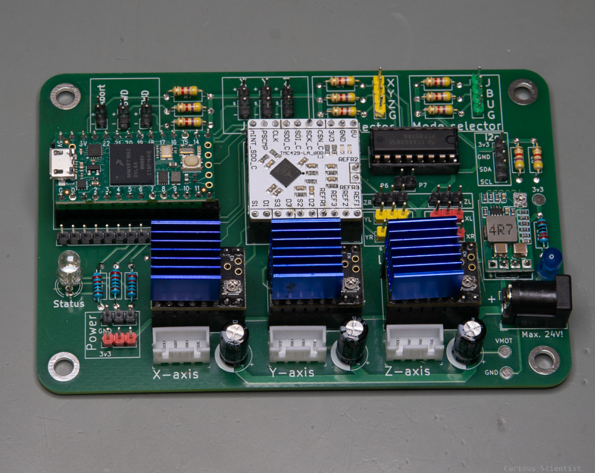
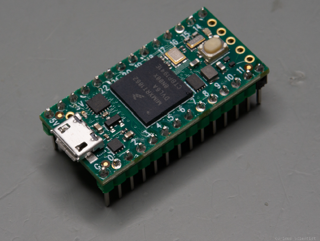
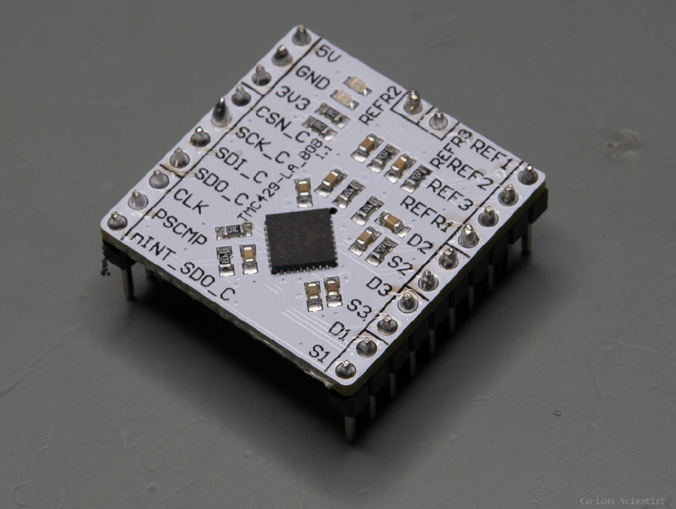
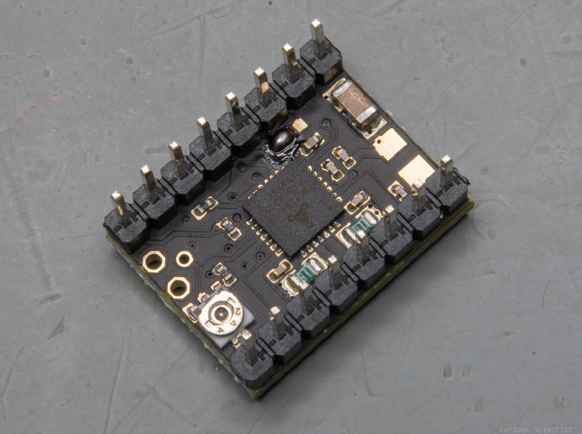
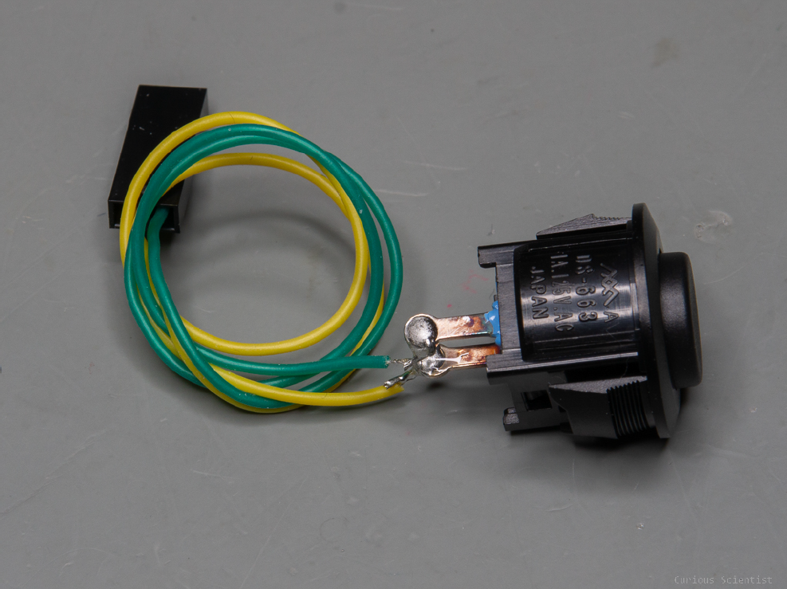
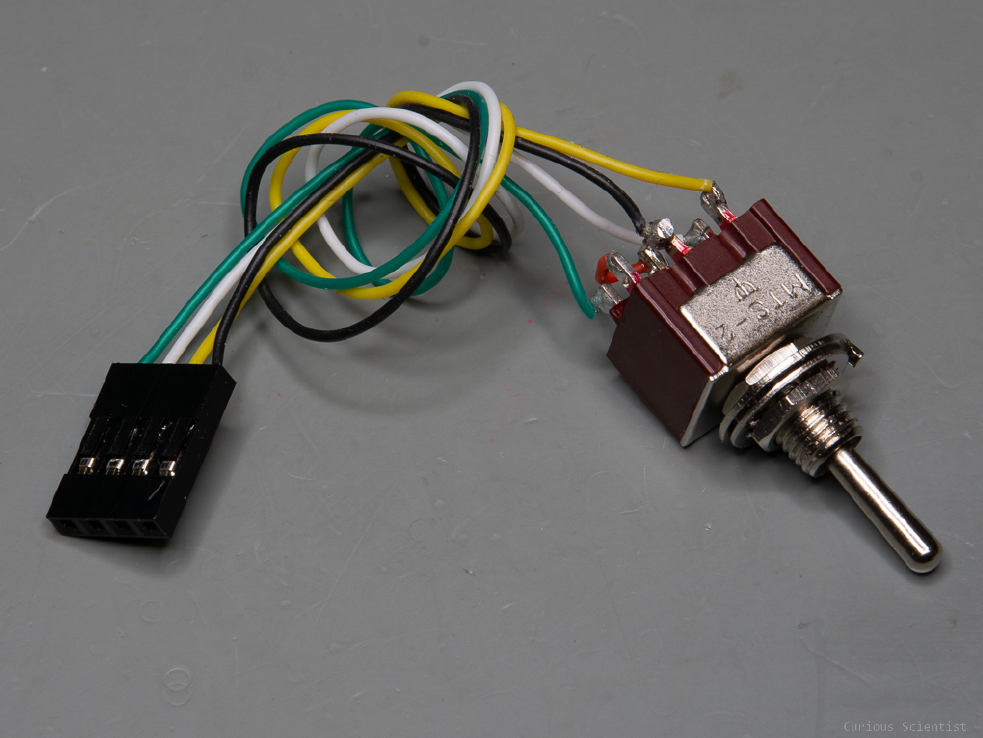
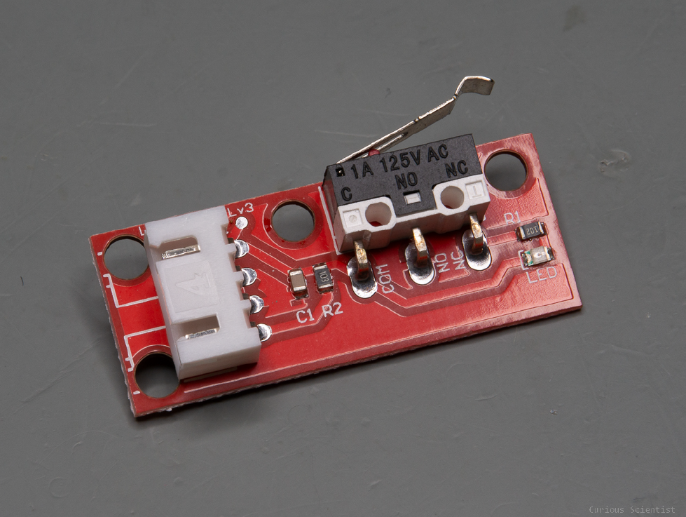

# 3-axis Stepper Motor Controller System

## Documentation and Manual

**Author:** Gergely Nemeth (Synchrotron SOLEIL, Wigner RCP), David Molnar (DM Devices)  
**Last updated:** May 16, 2026

## Contents

1. [Introduction](#1-introduction)
2. [Teensy 4.0](#2-teensy-40)
3. [TMC429](#3-tmc429)
4. [TMC2209](#4-tmc2209)
5. [PCF8574](#5-pcf8574)
6. [Buttons](#6-buttons)
7. [Joystick](#7-joystick)
8. [Selector switches](#8-selector-switches)
9. [Limit switches](#9-limit-switches)
10. [RGB status LED](#10-rgb-status-led)
11. [Mounting](#11-mounting)
12. [Onboard voltage regulator](#12-onboard-voltage-regulator)
13. [Miscellaneous information](#13-miscellaneous-information)
14. [Formulas](#14-formulas)
15. [Serial commands](#15-serial-commands)
16. [Useful links](#16-useful-links)

## 1. Introduction



*Figure 1: 3-axis stepper motor controller board.*

This system is a 3-axis stepper motor controller based on a Teensy 4.0 high-performance microcontroller, a TMC429 ramp generator, and three TMC2209 stepper motor drivers.

The system can be controlled in standalone mode using buttons or a joystick. It can also be controlled via USB by sending specially formatted commands through serial terminal software.

The board can be powered with up to 24 V DC from a power supply capable of supplying at least 3 A. The external power supply connects through a 2.5 x 5.5 mm center-positive DC barrel jack. It directly powers the three stepper motor drivers and also supplies a DC-DC converter that provides 3.3 V logic power to the other components, except for the Teensy 4.0.

The Teensy 4.0 must be powered by an external supply. Connect it to a computer or use a mobile phone charger. The recommended power-up sequence is:

1. Connect the external power supply to the board.
2. Power the Teensy 4.0.

This allows the microcontroller to connect properly to the external peripherals and initialize the stage.

All of the microcontroller's GPIOs are broken out, so the system can accept additional modules or external peripherals, such as a display.

The system supports limit switches on all three axes. These switches can be used for homing and as a safety feature to stop a motor when a switch is triggered.

### Licensing and disclaimer

This project is distributed under separate licenses according to the type of material:

- Hardware designs and schematics: CERN Open Hardware Licence Version 2 - Strongly Reciprocal (`CERN-OHL-S-2.0`).
- Firmware and the Python communication layer: MIT License.
- This documentation: Creative Commons Attribution 4.0 International (`CC BY 4.0`).

See the license files in the repository root for the applicable terms. The project is provided on an "as is" basis, without warranties to the extent permitted by law. Preserve the attribution to the SMIS beamline of synchrotron SOLEIL and DM Devices when redistributing or modifying the material.

## 2. Teensy 4.0

The Teensy 4.0 is a fast and versatile microcontroller. It has a sufficient number of GPIO pins, along with substantial memory and a high CPU clock speed.



*Figure 2: Teensy 4.0 microcontroller.*

The TMC429 ramp generator requires an external clock signal. The Teensy 4.0 provides this as a 32 MHz PWM signal. To make this signal as precise as possible, set the CPU speed to 528 MHz when compiling the source code.

The board also has multiple PWM pins, analog pins, I2C and SPI ports, and additional UART ports:

- PWM pins drive the RGB LED.
- Analog pins read the joystick.
- I2C and SPI connections communicate with the other modules.
- An additional UART port communicates with the three TMC2209 stepper motor drivers.

The Teensy 4.0 is powered via USB, either from a computer or from a power supply such as a phone charger.

## 3. TMC429

The TMC429 is a 3-axis ramp generator for stepper motors. It connects to the microcontroller through SPI and sends step and direction signals to three stepper motors simultaneously. It also handles six limit switches, two for each motor.



*Figure 3: TMC429 3-axis ramp generator.*

Its main advantage is that it unloads the microcontroller. The microcontroller only needs to send a command to the TMC429; the TMC429 then drives the motor according to a user-configured trapezoidal speed profile.

The TMC429 automatically generates the step pulses and tracks the number of steps sent to each motor, thereby tracking motor position. The microcontroller does not need to poll the step pins or perform the mathematical operations required to generate acceleration profiles.

## 4. TMC2209

The TMC2209 stepper motor drivers provide lower power consumption, quieter operation, and less heat generation than older drivers such as the A4988 and DRV8825. They also provide high-quality microstepping and can communicate via UART.



*Figure 4: TMC2209 stepper motor driver.*

The board is compatible with multiple versions of the TMC2209 driver. When using the original SilentStepStick module, modify its solder bridge before installing it on the board:

1. Locate the three solder tabs near one corner of the chip.
2. Short the center tab to the tab on its right.

This connects the UART pin to pin 12 (UART), rather than pin 11 (PDN). It is recommended to make this modification before soldering the other pins.

The polarity of each motor driver is the same. From left to right, each pair of pins belongs to one motor coil. According to the SilentStepStick pin layout, the pins are `M1B`, `M1A`, `M2A`, and `M2B`.

- `M1B` and `M1A` form one coil.
- `M2B` and `M2A` form the other coil.

Connect the stepper motor accordingly. If the motor rotates in the opposite direction, swap the coils.

## 5. PCF8574

The PCF8574 is a GPIO expander. It is used to avoid consuming six valuable Teensy 4.0 GPIO pins for the axis selector and mode selector switches.

These six pins are polled, so they do not require a high response speed or interrupt handling. The PCF8574 communicates with the microcontroller via I2C.

The module has eight pins in total, so the remaining two pins are available on the PCB for additional switches or buttons. One possible use is a speed multiplier button:

- One active pin could select 1x speed.
- The other active pin could select 5x speed.

This would allow the user to change speeds quickly while navigating the motors with the joystick or buttons.

## 6. Buttons

The module has three pre-installed buttons:



*Figure 5: Controller push button.*

- **Abort:** Aborts ongoing movement.
- **BWD:** Drives the selected axis in the negative direction.
- **FWD:** Drives the selected axis in the positive direction.

These buttons are active when the module is in button-controlled mode. If the Abort button is pressed while no motors are moving, the system performs homing one axis at a time.

## 7. Joystick

The module uses a 3-axis joystick to control the three stepper motors. The system responds to the joystick only when joystick mode is active.

When powered on, the microcontroller calibrates all three joystick axes to record their reference values. The joystick must be in its default position before powering on the device.

The joystick has 5 kOhm resistance potentiometers on all three axes. The X and Y axes are controlled by tilting the joystick, while the Z axis is controlled by twisting the joystick cap. All three axes are spring-loaded and return automatically to their initial positions when released.

In **USB mode**, the physical joystick can be replaced by a software-based joystick implemented on the host computer. For example, a 3D mouse can provide the three translation or rotation inputs, while a control application maps those inputs to the X, Y, and Z motor axes and sends the corresponding commands through the USB serial connection. This allows the controller to be operated with a 3D mouse without connecting a joystick directly.

## 8. Selector switches

The module has two 3-position selector switches:



*Figure 6: Three-position selector switch.*

- One selects the control mode.
- The other selects the active axis when the module is in button mode.

The three control modes are:

- **Joystick mode:** Control all three axes with the 3-axis joystick.
- **Button mode:** Select an axis and move it in the positive or negative direction with the buttons.
- **USB mode:** Send commands and parameters from a computer to control the three axes.

Each switch has a notch on its threaded part. Depending on which switch is being considered, the positions select the following options:

- Notch position: First option, X-axis or joystick mode.
- Center position: Second option, Y-axis or button mode.
- Third position: Third option, Z-axis or USB mode.

## 9. Limit switches

The system has six limit switches, with two switches assigned to each axis. Each switch acts as a stop switch. If a switch is hit during motor movement, the motor stops and parks.



*Figure 7: Limit switch module.*

Each axis also has a home switch, configured in this application as the left switch. After homing, each axis is considered to be at position `0 mm`.

Because of the TMC429 circuit, a pressed limit switch can still block the corresponding motor while it is moving.

The limit switches must be high by default. When pressed, a switch must pull its signal pin to ground (low). To change this behavior, refer to the TMC429 datasheet, page 33. The source code also indicates how to switch between active-high and active-low modes.

All switches must behave in the same way. It is not permitted to mix active-high and active-low configurations.

If a different type of limit switch is used, install the appropriate pull-up resistor. An unpressed switch should produce 3.3 V on the signal (`S`) pin, and the signal pin should also be connected to ground through a 4.7 kOhm resistor.

When a limit switch is hit during movement, the motor immediately stops and parks. The status LED turns red. The system will not respond to further instructions for the axis that triggered the switch until the axis is unlocked.

To unlock the axis, move the mode selector or axis selector switch to a different position. When the LED turns blue, the system is unlocked.

During homing, the stepper motors approach their home positions more slowly than during normal movement. After parking, the original speed settings are restored. These speed values depend on the mechanism and motor arrangement, so adjust them to achieve the desired behavior.

## 10. RGB status LED

The controller status is indicated by an RGB LED. Each color is driven by a PWM signal. The LED color depends on the magnitude and proportion of the three PWM signals.

| LED status | Meaning |
| --- | --- |
| Blue | Standby. The motors are stationary and the module is waiting. |
| Blinking blue | GPIO status change. An axis or mode selector switch changed. |
| Green | In progress. One of the motors is moving. |
| Red | Limit switch active. One of the six limit switches was hit. |
| Blinking red | Abort. The Abort button was pressed. |
| Orange | Communication error. The TMC429 module is not responding. |

## 11. Mounting

The board has a padded M4 mounting hole at each corner. Use plastic washers on both sides when mounting the board to preserve its longevity.

## 12. Onboard voltage regulator

The onboard voltage regulator is an adjustable, off-the-shelf regulator based on the MP2315 chip. It is fed from the input voltage line, which also powers the three TMC2209 stepper motor drivers, and accepts up to 24 V.

The output voltage is fixed at 3.3 V and provides logic power to the board components except the Teensy 4.0. The regulator's maximum output current is 3 A.

The circuit intentionally does not power the Teensy 4.0. Since the board can be controlled from a computer through a serial terminal, it is assumed that it is constantly connected to one. To avoid possible damage from powering the circuit from multiple sources, the board's 3.3 V power line is not connected to the Teensy 4.0.

When using the board in standalone mode, a simple mobile phone charger is sufficient to power the Teensy 4.0.

**Alternatively**, an additional 5V downconverter can be added to provide constant power to the Teensy 4.0. For this, the USB power trace needs to be cut on the board. For further information see the official guide and forum:
- Teensy tutorial: [external power][teensy_website]
- Teensy forum: [Teensy 4.0 using external power][teensy_forum]

[teensy_forum]:https://forum.pjrc.com/index.php?threads/teensy-4-0-using-external-power.66111/
[teensy_website]:https://www.pjrc.com/teensy/external_power.html

## 13. Miscellaneous information

When powering on the device for the first time, make sure that all three axes have enough range of motion to avoid collisions. Different motors and mechanisms may respond differently to the same speed settings, especially when the attached mechanisms differ. The axes may also be inverted depending on the wiring.

Match the motor polarity physically with the stage and its motors to achieve correct behavior. When the motor moves in the negative direction, the stage should move toward the respective motor and the left-hand switch, which is the home switch.

This is particularly important for homing. During homing, the motor moves in the negative direction toward the motor that moves the active axis.

Because of the complexity of the homing procedure, homing cannot currently be canceled or aborted. Make sure the system can complete homing when instructed. To abort homing, remove power from the microcontroller. This also resets the entire system.

## 14. Serial commands

The firmware reads newline-terminated commands from the USB `Serial` port at 9600 baud. Commands use the form shown below, with arguments separated by spaces. Motor numbers are `0` for X, `1` for Y, and `2` for Z.

### Movement and position

| Command | Arguments | Description | Response |
| --- | --- | --- | --- |
| `gp` | `motor` | Gets the actual position of a motor. | `PO motor position` |
| `sp` | `motor position` | Sets the actual and target position of a motor. | `PO motor position` |
| `mr` | `motor steps` | Moves a motor relative to its current position by the specified number of steps. | `MO motor moving` |
| `ma` | `motor position` | Moves a motor to an absolute position in steps. | `MO motor moving` |
| `mo` | `motor` | Checks whether a motor is moving. | `MO motor moving` |

Examples:

```text
gp 0
mr 1 800
ma 2 16000
mo 0
```

### Limit switches

| Command | Arguments | Description | Response |
| --- | --- | --- | --- |
| `ea` | `state` | Enables or disables the advanced switch-stop behavior. | `SA state` |
| `es` | `state` | Enables or disables all limit switches. | `SE state` |
| `ss` | `motor state` | Enables or disables limit switches for one motor. | `SS motor left_active right_active` |
| `gs` | `motor` | Gets the left and right switch states for one motor. | `SS motor left_active right_active` |

Use `0` or `1` for boolean state arguments.

### Microstepping and move mode

| Command | Arguments | Description | Response |
| --- | --- | --- | --- |
| `sm` | `motor microsteps` | Sets the microstepping value for one motor driver. | `MS motor microsteps steps_per_revolution` |
| `mm` | `motor mode` | Changes the move mode for one motor. | `MM motor mode` |

### Velocity and acceleration

| Command | Arguments | Description | Response |
| --- | --- | --- | --- |
| `sv` | `motor maximum_velocity` | Sets the maximum velocity for one motor. | `VM motor velocity` |
| `tv` | `motor target_velocity` | Sets the target velocity for one motor. Values above 2047 are limited to 2047. | `VT motor velocity` |
| `sa` | `motor maximum_acceleration` | Sets the maximum acceleration for one motor. | `AM motor acceleration` |
| `gv` | `motor` | Gets the current velocity-related settings for one motor. | `MV motor microsteps maximum_velocity maximum_acceleration target_velocity` |

### Driver autotuning

| Command | Arguments | Description | Response |
| --- | --- | --- | --- |
| `at` | `motor` | Runs driver autotuning for one motor. | `AT motor pwm_scale pwm_offset pwm_gradient` |

The following commands are present only as commented-out registrations in the firmware and are not currently available: `2r`, `2a`, `gm`, `ho`, `ga`, and `gt`.

## 16. Useful links

The original document lists the following resources:

- [TMC429 Arduino library][tmc429_lib]
- [TMC2209 Arduino library][tmc2209_lib]
- [TMC429 datasheet][tmc429_d]
- [TMC2209 datasheet][tmc2209_d]
- [Teensy 4.0 website][teensy_website_basic]

[tmc429_lib]: https://github.com/janelia-arduino/TMC429
[tmc2209_lib]: https://github.com/janelia-arduino/TMC2209
[tmc429_d]: https://www.analog.com/en/products/tmc429.html
[tmc2209_d]: https://www.analog.com/en/products/tmc2209.html
[teensy_website_basic]:https://www.pjrc.com/store/teensy40.html